   
# Installing Splunk on Ubuntu Server

## Introduction  
Splunk is a powerful tool for analyzing and visualizing machine-generated data. It provides real-time insights, making it ideal for monitoring network activity and security.  
In this guide, I’ll explain how to install and configure Splunk in my home lab. I’ll be forwarding logs from my Dream Machine router to analyze Intrusion Prevention System (IPS) logs and login activity.  

## Why Ubuntu Server?  
Ubuntu Server is lightweight and efficient, designed specifically for server environments. It comes without a GUI, minimizing resource usage, which is ideal for applications like Splunk that don’t require a graphical interface to run it.  

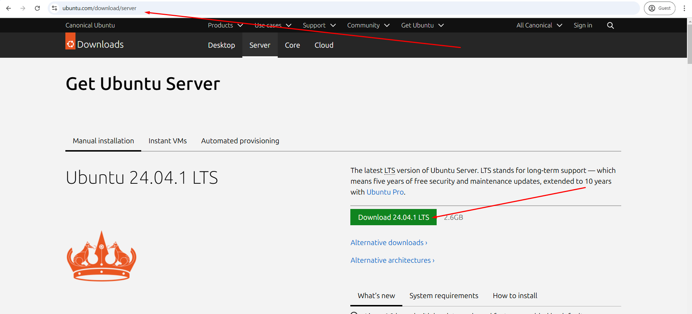

---

## Step 1: Create a Virtual Machine in VirtualBox  

1. Open VirtualBox and click **New**.  

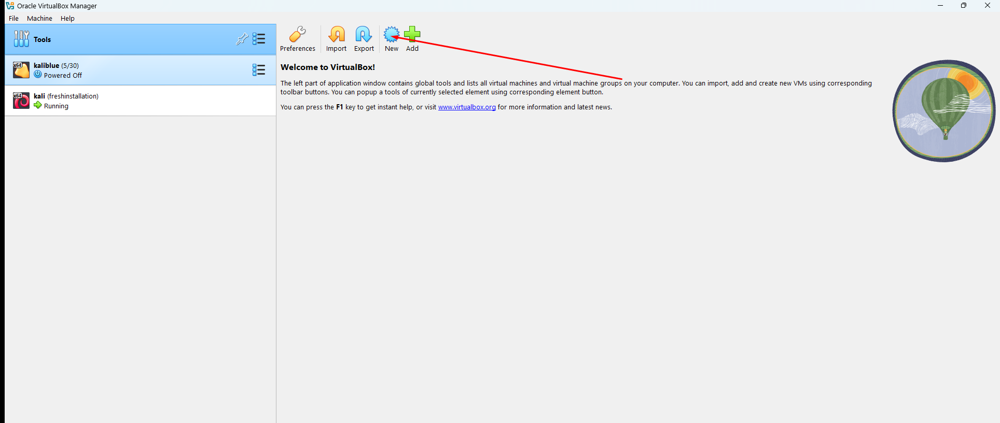


2. Name your virtual machine, choose a storage folder, and select the Ubuntu Server ISO file. 
 
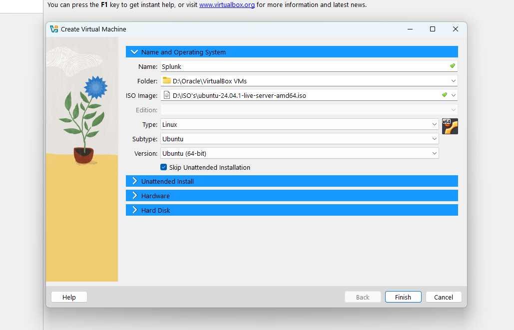

3. Skip the **Unattended Installation**.  

4. Allocate resources based on your system:  
   - **RAM**: 6-8 GB  
   - **CPU Cores**: 2-4  
   - **Storage**: 100 GB  

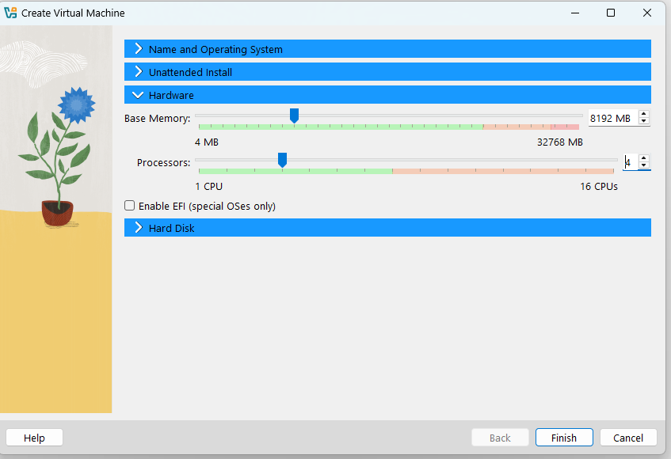

---

## Step 2: Install Ubuntu Server  

1. Start the VM, and from the **GNU GRUB** screen, select **Install Ubuntu Server**. 

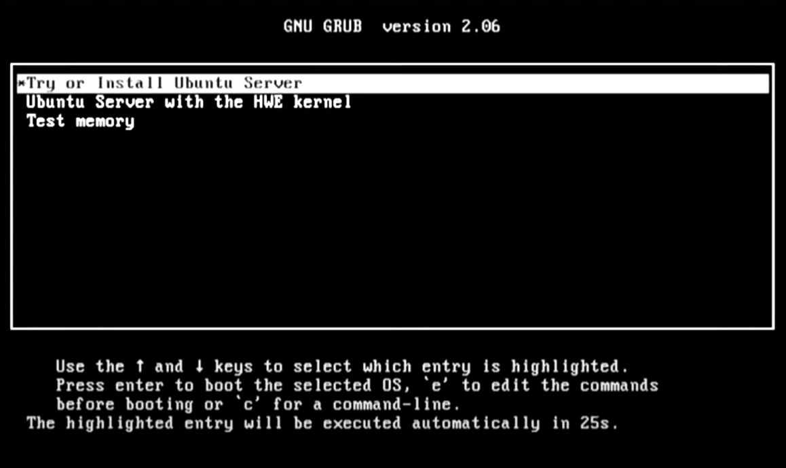

2. Set up your username and password.  

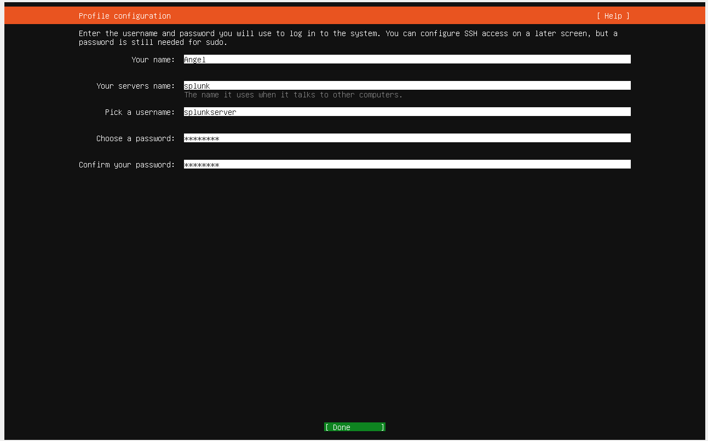

3. For SSH configuration, you can skip or enable it based on your preference.  

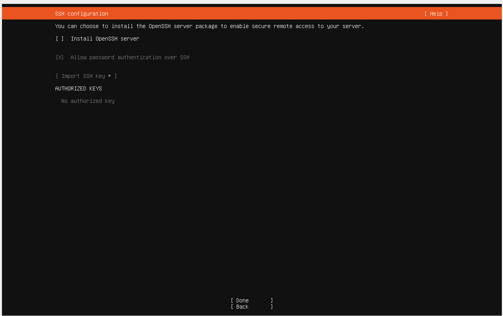

4. Select **Done** and then **Reboot Now**.  

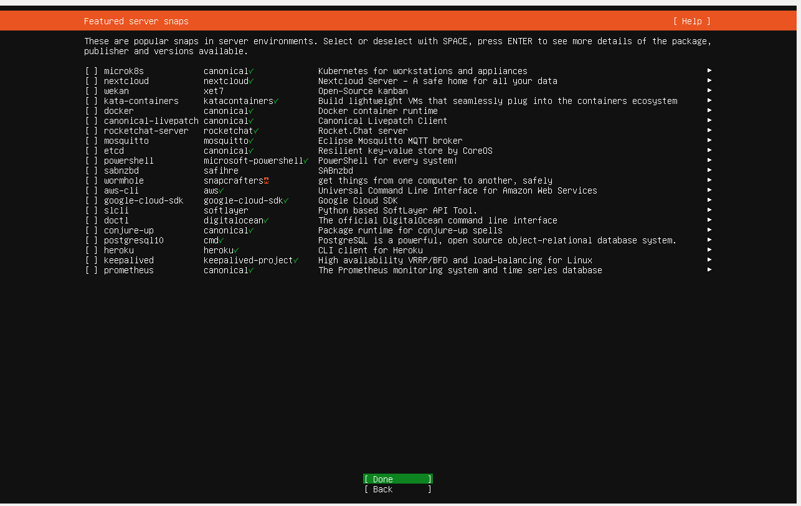

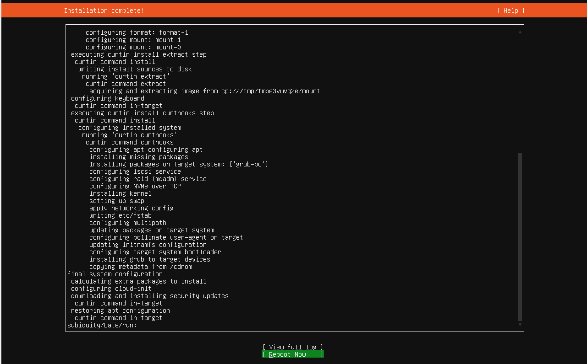

5. If prompted with a failed message, press **Enter** to continue.  


---

## Step 3: Update and Upgrade the System  
1. Log in with your username and password.  

2. Run the following commands:  
   ```bash
   sudo apt update && sudo apt upgrade -y

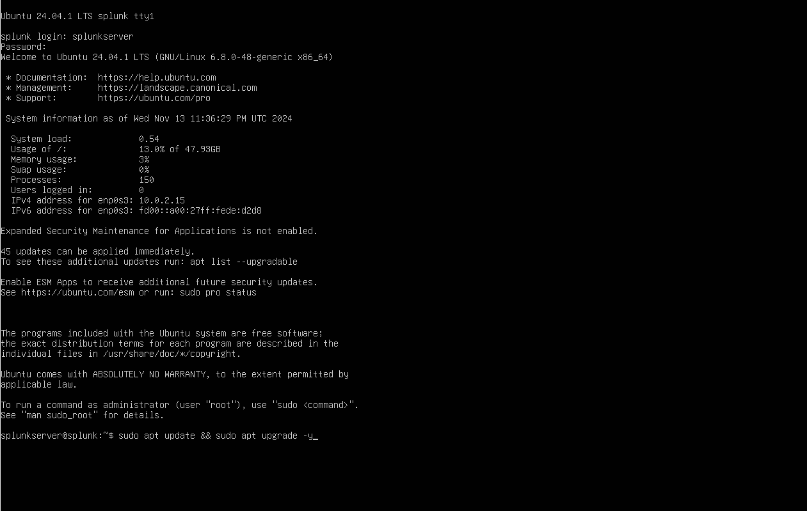
   
## Step 4: Configure a Static IP 

1. Run the following command to check your network interface and IP:
```bash 
   ip a
```
   If you’re using a Bridged Adapter in your VM, the network should match your host. If you prefer isolation, you can use NAT by changing the settings of the VM in Network > attached to.
   
2. Edit the Netplan configuration file:
   ```bash
   sudo nano /etc/netplan/00-installer-config.yaml
   
3. Add the following configuration changing the x:
```bash
network:
  ethernets:
    eth0:
      dhcp4: no
      addresses:
        - 192.168.x.x/24
      gateway4: 192.168.x.1
      nameservers:
        addresses:
          - 8.8.8.8
          - 8.8.4.4
  version: 2
```
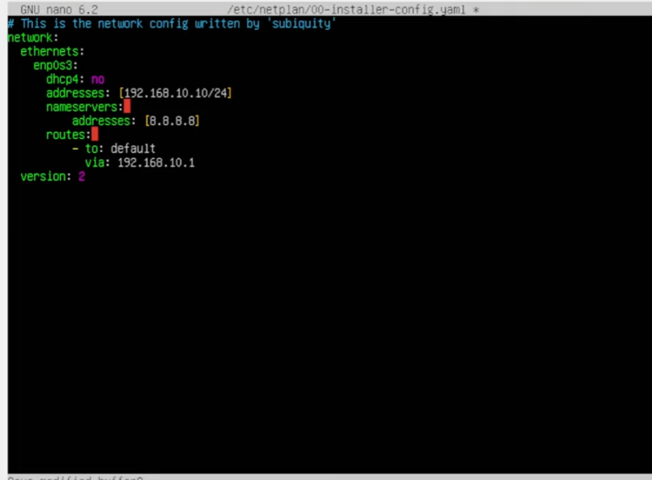

**In my case, I am using the UniFi Gateway. Similar routers also allow you to perform this configuration, so you can skip the step below if you have access to and can edit the fixed IP settings of your devices.**

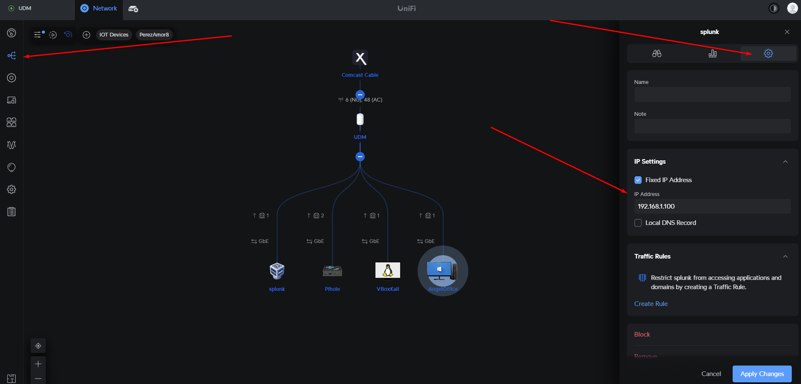


4. Apply the changes:
```bash
sudo netplan apply
```

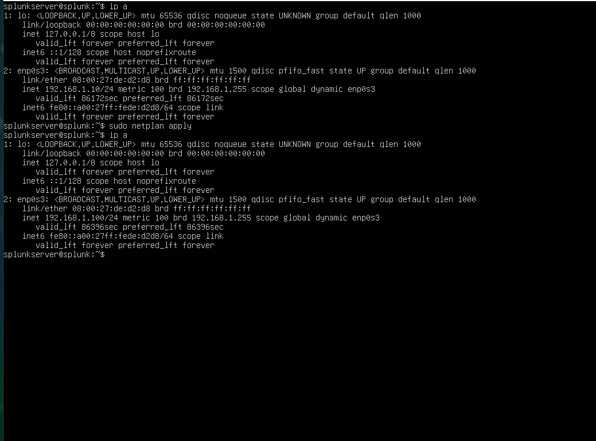

5. Verify the changes with "ip a" again

## Step 5: Install Splunk  

1. First, download Splunk. You'll need to create an account. Once logged in, navigate to **Products** and click on **Get My Free Trial**.  


2. Select **Linux** as your platform and copy the `wget` link for the `.deb` package.  

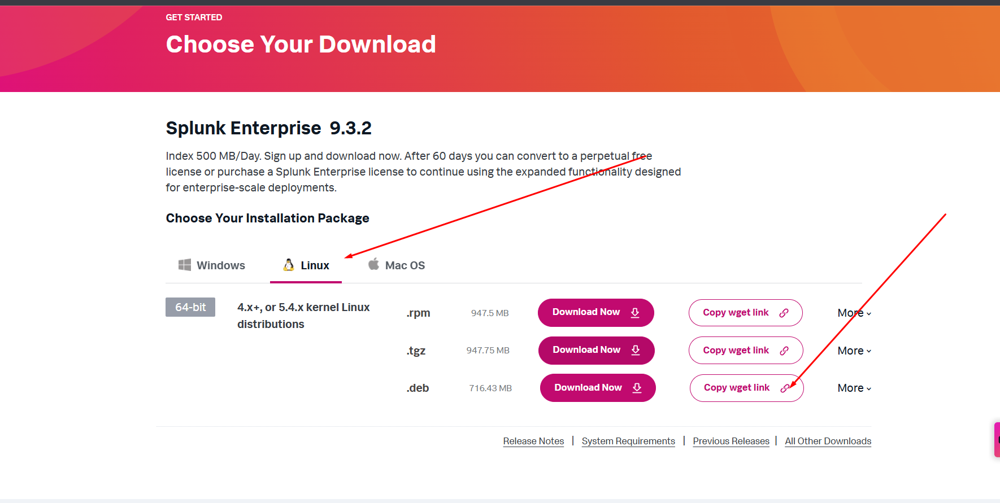

3. If you already installed SSH during the Ubuntu Server installation, you can skip the next 4 steps.  

4. To install SSH manually, run the following command:  
   ```bash
   sudo apt install openssh-server

5. Check if SSH is running by using the following command:
   ```bash
   sudo systemctl status ssh


6. Enable SSH to start on boot:
   ```bash
   sudo systemctl enable ssh


7. Check if the Ubuntu firewall (UFW) is active:
    ```bash
   sudo ufw status

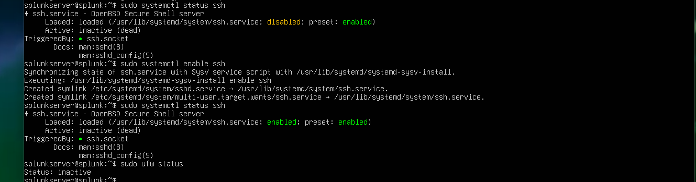

8. Now you can SSH into your server using Command Prompt, PowerShell, or Git Bash:
   ```bash
   ssh <username>@<ubuntu-ip>
   ```
Enter the server password when prompted. This allows you to manage the server remotely.

Use the wget link copied earlier and paste it in the terminal

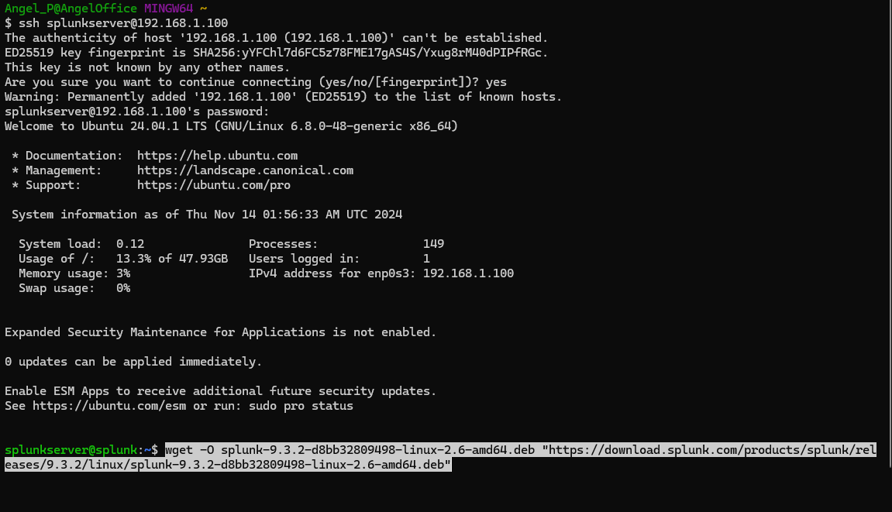

Note: I couldn't get the additional guest drivers for VirtualBox to work, so I used this method to copy the Splunk URL directly.

9. Install Splunk with the following command:
    ```bash
    sudo dpkg -i <splunk-deb-file>
    
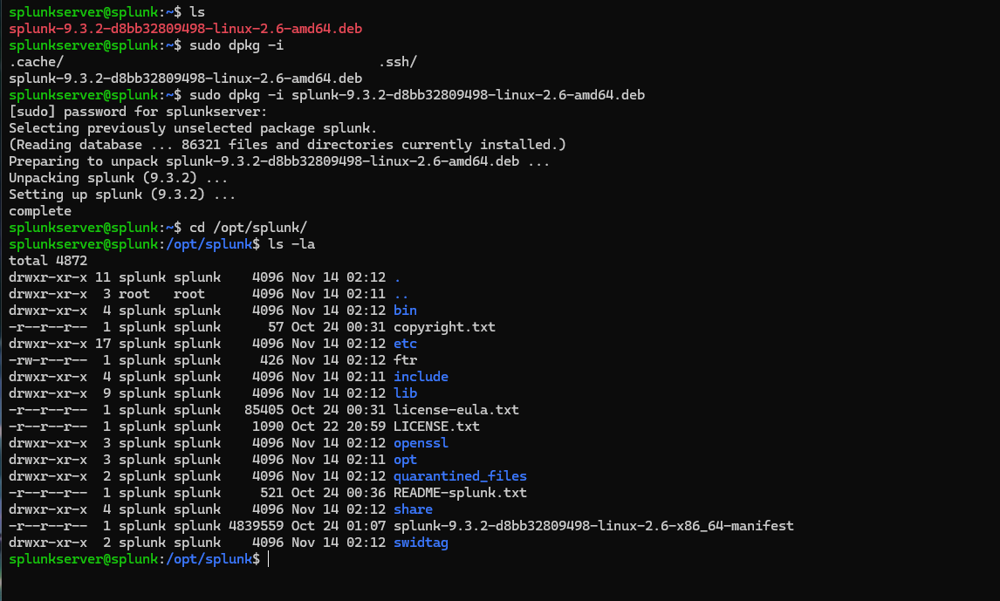

10. Navigate to the Splunk installation directory and list the files:
    ```bash
    cd /opt/splunk
    ls -la


11. Start Splunk by switching to the Splunk user and navigating to the bin directory:
    ```bash
    sudo -u splunk bash
    cd bin
    ./splunk start

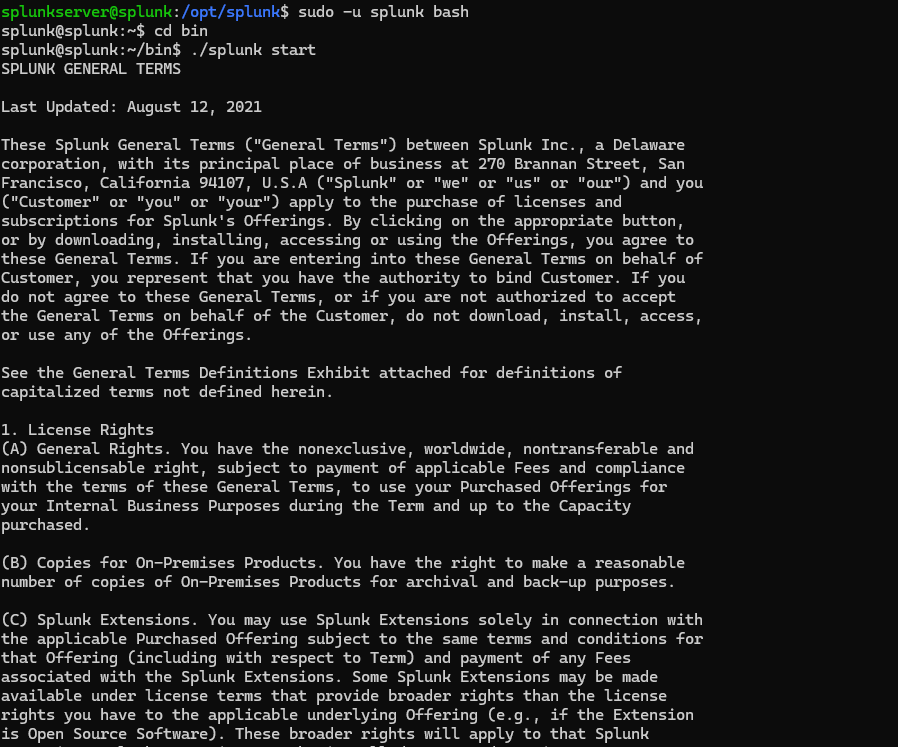

Using the Splunk user ensures that all operations are run with the proper permissions and security configurations specifically set for Splunk, avoiding potential issues with file ownership and execution.

**It will ask for a username and password. These can be different, but make sure to remember them as you will need them to access Splunk**

12. Now exit from the Splunk user and navigate to the `bin` directory:  
    ```bash
    exit
    cd /opt/splunk/bin/
    ```  
    Use the following command to enable Splunk to start on boot:  
    ```bash
    sudo ./splunk enable boot-start -user splunk
    ```

13. Finally, your Splunk server is up and running!  
    On your host machine, open a browser and type the following to access the Splunk web interface:  
    ```plaintext
    <ip>:8000
    ```  
    Replace `<ip>` with the static IP address of your Splunk server.  

    Log in using the username and password you created during the Splunk setup.

---
