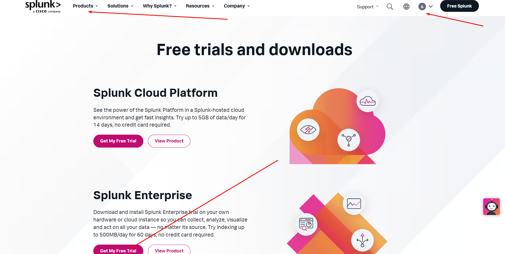

   
# Installing Splunk on Ubuntu Server


## Introduction  
Splunk is a powerful tool for analyzing and visualizing machine-generated data. It provides real-time insights, making it ideal for monitoring network activity and security.  
In this guide, I’ll explain how to install and configure Splunk for a home lab. I’ll be forwarding logs from my Dream Machine router to analyze Intrusion Prevention System (IPS) logs and login activity.  

## Why Ubuntu Server?  
Ubuntu Server is lightweight and efficient, designed specifically for server environments. It comes without a GUI, minimizing resource usage, which is ideal for applications like Splunk that don’t require a graphical interface to run it.  


---

## Step 1: Create a Virtual Machine in VirtualBox  

1. Open VirtualBox and click **New**.  


2. Name your virtual machine, choose a storage folder, and select the Ubuntu Server ISO file. 
 


3. Skip the **Unattended Installation**.  

4. Allocate resources based on your system:  
   - **RAM**: 6-8 GB  
   - **CPU Cores**: 2-4  
   - **Storage**: 100 GB  


---

## Step 2: Install Ubuntu Server  

1. Start the VM, and from the **GNU GRUB** screen, select **Install Ubuntu Server**. 


2. Set up your username and password.  


3. For SSH configuration, you can skip or enable it based on your preference.  


4. Select **Done** and then **Reboot Now**.  


5. If prompted with a failed message, press **Enter** to continue.  


---

## Step 3: Update and Upgrade the System  
1. Log in with your username and password.  

2. Run the following commands:  
   ```bash
   sudo apt update && sudo apt upgrade -y


   
## Step 4: Configure a Static IP 

1. Run the following command to check your network interface and IP:
```bash 
   ip a
```
   If you’re using a Bridged Adapter in your VM, the network should match your host. If you prefer isolation, you can use NAT by changing the settings of the VM in Network > attached to.
   
2. Edit the Netplan configuration file:
   ```bash
   sudo nano /etc/netplan/00-installer-config.yaml
   
3. Add the following configuration changing the IP for yours IP:
```bash
network:
  ethernets:
    eth0:
      dhcp4: no
      addresses:
        - 192.168.x.x/24
      gateway4: 192.168.x.1
      nameservers:
        addresses:
          - 8.8.8.8
          - 8.8.4.4
  version: 2
```


**In my case, I am using the UniFi Gateway. Similar routers also allow you to perform this configuration, so you can skip the step below if you have access to and can edit the fixed IP settings of your devices.**


4. Apply the changes:
```bash
sudo netplan apply
```


5. Verify the changes with "ip a" again

## Step 5: Install Splunk  

1. First, download Splunk. You'll need to create an account. Once logged in, navigate to **Products** and click on **Get My Free Trial**.  



2. Select **Linux** as your platform and copy the `wget` link for the `.deb` package.  


3. If you already installed SSH during the Ubuntu Server installation, you can skip the next 4 steps.  

4. To install SSH manually, run the following command:  
   ```bash
   sudo apt install openssh-server

5. Check if SSH is running by using the following command:
   ```bash
   sudo systemctl status ssh


6. Enable SSH to start on boot:
   ```bash
   sudo systemctl enable ssh


7. Check if the Ubuntu firewall (UFW) is active: 
    ```bash
   sudo ufw status

if it is not active, you can leave it as it or enable it and allow SSH:

`sudo ufw allow ssh`
`sudo ufw reload`

Now, we need to allow the Ubuntu server to receive Syslog messages from other devices. In this case, we'll use port 10154 on UDP:

`sudo ufw allow 10154/udp`


8. Now you can SSH into your server using Command Prompt, PowerShell, or Git Bash:
   ```bash
   ssh <username>@<ubuntu-ip>
   ```
Enter the server password when prompted. This allows you to manage the server remotely.

Use the wget link copied earlier and paste it in the terminal


Note: I couldn't get the additional guest drivers for VirtualBox to work, so I used this method to copy the Splunk URL directly.

9. Install Splunk with the following command:
    ```bash
    sudo dpkg -i <splunk-deb-file>
    


10. Navigate to the Splunk installation directory and list the files:
    ```bash
    cd /opt/splunk
    ls -la


11. Start Splunk by switching to the Splunk user and navigating to the bin directory:
    ```bash
    sudo -u splunk bash
    cd bin
    ./splunk start


Using the Splunk user ensures that all operations are run with the proper permissions and security configurations specifically set for Splunk, avoiding potential issues with file ownership and execution.

**It will ask for a username and password. These can be different, but make sure to remember them as you will need them to access Splunk**

12. Now exit from the Splunk user and navigate to the `bin` directory:  
    ```bash
    exit
    cd /opt/splunk/bin/
    ```  
    Use the following command to enable Splunk to start on boot and splunk will run with the user splunk
    ```bash
    sudo ./splunk enable boot-start -user splunk
    ```


13. Finally, your Splunk server is up and running!  
    On your host machine, open a browser and type the following to access the Splunk web interface:  
    ```plaintext
    <ip>:8000
    ```  
    Replace `<ip>` with the static IP address of your Splunk server.  

    Log in using the username and password you created during the Splunk setup.


---

## Step 6: Send Data to Splunk  

1. **Understanding Data Inputs in Splunk**  
   Now that Splunk Enterprise is running, we need to send data to the server for indexing and analysis. Splunk's ability to search, filter, and visualize data depends on the data it indexes. This process involves receiving logs or metrics from various devices or applications and making them searchable.  

   For this guide, we’ll configure Splunk to receive logs from a network device — the Dream Machine router. These logs include **Intrusion Prevention System (IPS)** logs and login activity, which are critical for monitoring network security. By forwarding this data to Splunk, we can analyze traffic patterns, detect threats, and review login attempts.  

2. **Configuring the Dream Machine Router to Forward Logs**  
   To send data to Splunk, configure the Dream Machine router to forward logs:  
   - Navigate to the router’s **SIEM Server** settings.  
   - Set the **Server Address** to the IP address of your Splunk server.  
   - Specify a **Port** for log forwarding. It’s common to use a higher port (e.g., 10154) because Splunk typically requires elevated privileges to listen on ports below 1024.  

   This step ensures that your router sends its syslog data (including IPS and login logs) to the Splunk server for analysis.


3. **Configuring Splunk to Receive Syslog Data**  
   On the Splunk server, log in to the Splunk web interface and configure a data input to receive logs:  
   - Go to **Settings** > **Data Inputs**.  
   - Select **UDP** as the input method.  

   **Why use UDP and Syslog?**  
   Syslog is a standardized protocol used for logging system messages and events across a network. It typically uses **UDP** (User Datagram Protocol) on port 514 by default. However, for this setup, we’ll use a custom port, **10154**, to avoid conflicts and maintain flexibility.


4. **Configuring UDP Data Input in Splunk**  
   In the UDP Data Input configuration:  
   - Set the **Port** to `10154`.  
   - For **Source Type**, select `syslog`.  
   - Set the **App Context** to `Unifi` (or any name representing your Dream Machine logs).  
   - For **Index**, create a new index (e.g., `ubnt`) by going to **Settings** > **Indexes** and clicking **New Index**.  
   - Click **Review** and then **Done** to save the configuration.  

   This setup ensures Splunk is ready to receive and index logs forwarded from your Dream Machine router.


5. **Start Searching for Logs**  
   Once data is being forwarded and indexed, you can search for it in Splunk using the following query:

  `index=ubnt`

 

6. **Configure Time Zone**

When analyzing logs, having consistent timestamps is critical for accurate correlation and analysis. If the logs forwarded to Splunk have a different time zone than your Splunk instance, it can cause confusion or lead to incorrect interpretations of the data.

To ensure consistency, you can change the time zone for your Splunk user:  
   - Navigate to **Settings** > **Users**.  
   - Select your username from the list.  
   - Change the **Time Zone** to match the time zone of the forwarded logs or your local time zone.  
   - Save the changes.
     


 ---

## Step 7: Create a New Field  

1. **Why Create a New Field?**  
   Creating a new field helps in organizing, filtering, and analyzing data more effectively. For example, if you're analyzing logs from your Dream Machine router, you might want to extract specific information such as login usernames, IP addresses, or intrusion event types. By defining custom fields, you can tailor Splunk's search and analysis capabilities to your specific needs.

2. **Extract a New Field**  
   - Log in to the Splunk web interface.  
   - Navigate to the index you want and at right side select Extract New Field 
   - Select the source data you want to extract fields from.
  


3. **Use Regular Expressions for Specific Data Filters**  
   - Identify the data you want to extract from the raw logs. For instance, you may want to extract activity related to a specific administrator or event type.  
   - Click on **Show Regular Expression** to view the current regex or create a new one.  

 

4. **Edit the Regular Expression**  
   - For a more precise data filter, you can customize the regex to match your data.  
   - In my case, I used the following regex to extract specific admin activities:  
     ```regex
     \|(?P<Admin_Activity>user[^|]+)\|
     ```  
     - `Admin_Activity` is the name of the field being created.  
     - `user` is the specific activity or value I want to extract.  
     - `[^|]+` matches everything until the next `|` character.  

 
 
5. **Save and Test**  
   - After editing the regex, save your changes.  
   - Run a search query to test the new field, such as:  
     ```spl
     index=ubnt Admin_Activity="user"
     ```  
   - Verify that the field extraction works as expected and the results align with your intended data.

---

## Step 8: Create a Dashboard  

Finally, I’m going to create a dashboard that helps me analyze the activity logs forwarded from my Dream Machine router. This dashboard will allow me to monitor Intrusion Prevention System (IPS) logs, login activities, and administrative tasks, providing a clear and dynamic visualization of my network's security posture.

1. **Run a Search Query**  
   To begin, we need to run a search query that will serve as the basis for our dashboard panel. I’m using the following query to analyze admin activity logs:  
   ```spl
   index=ubnt | dedup _time | stats count by Admin_Activity

 

2. **Visualize the Data**

   - After running the query, click on the Visualization tab.
   - Select Pie Chart as the visualization type.

 

3. **Save the Visualization to a Dashboard**

   - Click Save As > New Dashboard.
   - Enter the following details:
   - Dashboard Title: Choose a meaningful title for your dashboard (e.g., "Network Activity Overview").
   - Description: Provide a short description of the dashboard's purpose (e.g., "Visualizing admin activities and IPS logs from the Dream Machine router.").
   - Dashboard Studio: Select Dashboard Studio for an enhanced editing experience.
   - Panel Title: Name the panel (e.g., "Admin Activity Overview").
   - Click Save to create the dashboard.

4. **Make the Dashboard Dynamic**

   - Open the newly created dashboard.
   - Click Edit on the data source settings.
   - Under Time Range Input, select Global Time Range to allow dynamic time filtering for all panels.
   - Click Apply to save the changes.

 

 
